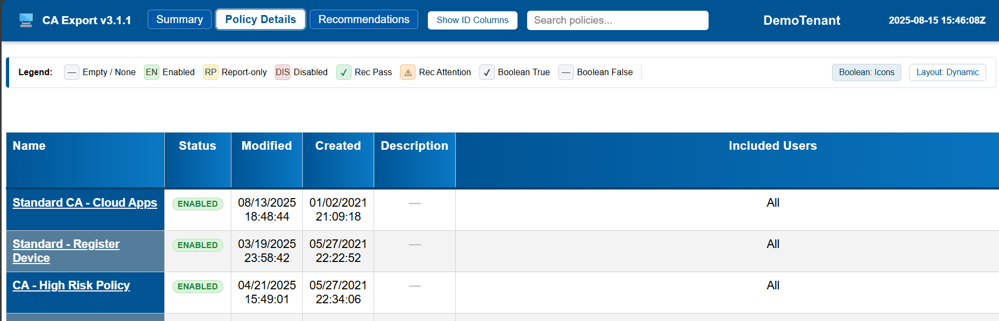

 # CA-Export

Export and analyze Microsoft Entra ID (Azure AD) Conditional Access (CA) policies for documentation, security review, and remediation planning.

Two scripts are provided:

| Script | Purpose |
|--------|---------|
| `Export-CaPolicy.ps1` | Lightweight export – single HTML table of policies. |
| `Export-CAPolicyWithRecs.ps1` | Full featured export – enrichment, recommendations, duplicate detection, multiple output formats, interactive HTML UI. |

---
## Key Features (Full Export Script)

* Automatic Microsoft Graph connection (Policy.Read.All, Directory.Read.All, RoleManagement.Read.All).
* Policy enrichment: resolves Users, Groups, Roles (active + template/definition), Service Principals, Named Locations, Terms of Use.
* Duplicate policy detection (normalized JSON → SHA256 hash) with cross‑reference listing.
* Interactive HTML report with tabbed layout:
	* Summary (metrics & percentages)
	* Policy Details (search/filter table; highlight matching cell values; per‑column highlight)
	* Recommendations (status, rationale, links, pass/attention filter buttons)
* Legend / utility bar (status badges, recommendation icons, boolean toggle, ID column toggle)
* Layout toggle (dynamic natural column widths vs fixed legacy widths)
* Boolean display toggle (icons ✔/— or text True/False)
* Description clamp (expand/collapse with accessible aria attributes)
* Per‑policy original vs mutated JSON toggle + Copy JSON button (clipboard)
* Preference persistence (remembers active tab, boolean mode, ID column visibility, recommendation filter)
* Accessibility: keyboard‑navigable tabs, aria-live announcements (copy feedback), sticky headers, focusable controls
* CSV (long), CSV Pivot (wide) and JSON export options
* Duplicate detection, role/name resolution, risk & device metrics in Summary
* Optional fast mode: `-NoRecommendations` skips recommendation analysis (faster, omits Recommendations tab & related JavaScript/state)

Screenshots:




---
## Installation / Prereqs

PowerShell 7+ recommended. Ensure Microsoft Graph modules are installed. You can install all of the modules using:

```powershell
Install-Module Microsoft.Graph -Scope CurrentUser
```

To target only the required Microsoft Graph modules, you can specify them individually:

```powershell
Install-Module Microsoft.Graph.Authentication -Scope CurrentUser
Install-Module Microsoft.Graph.Identity.DirectoryManagement -Scope CurrentUser
Install-Module Microsoft.Graph.Identity.SignIns -Scope CurrentUser
```

When the script runs it will request admin consent to allow it to use Microsoft Graph, if this not already granted. If you do not have permission to grant admin consent, you will need to work with your Entra ID administrator to obtain the necessary permissions.

---
## Quick Start

```powershell
# Basic full export (now defaults to HTML + JSON + CSV)
./Export-CAPolicyWithRecs.ps1

# All formats
./Export-CAPolicyWithRecs.ps1 -Html -Json -Csv -CsvPivot

# Single policy by Id (also export JSON)
./Export-CAPolicyWithRecs.ps1 -PolicyID 11111111-2222-3333-4444-555555555555 -Json

# Custom CSV columns
./Export-CAPolicyWithRecs.ps1 -Csv -CsvColumns Name,Status,'Require MFA','Block'

# Fast export (skip recommendations & omit tab)
./Export-CAPolicyWithRecs.ps1 -NoRecommendations
```

**Output files are timestamped:**
- Full script: `CAExportRecs_<TenantName>_YYYYMMDD_HHMMSS.*`
- Lightweight script: `CAExport_<TenantName>_YYYYMMDD_HHMMSS.*`

---
## Parameters (Full Script)

| Parameter | Type | Description |
|-----------|------|-------------|
| `PolicyID` | String (GUID) | Limit export to a single CA policy. |
| `Html` | Switch | Emit interactive HTML (default if no other export is chosen). |
| `NoBrowser` | Switch | Generate HTML without automatically launching browser. |
| `OutputPath` | String | Custom output directory path (defaults to current directory). |
| `Json` | Switch | Emit enriched JSON (includes duplicate markers). |
| `Csv` | Switch | Emit flattened CSV of policies. |
| `CsvPivot` | Switch | Emit pivot‑friendly wide CSV. |
| `CsvColumns` | String[] | Custom column subset/order for `-Csv`. |
| `NoRecommendations` | Switch | Skip recommendation analysis & omit Recommendations tab (improves runtime in large tenants). |

If no export switch is specified, HTML, JSON, and CSV are produced automatically (pivot remains opt-in).

---
## Recommendation Checks

The recommendation engine currently evaluates:

1. Legacy Authentication blocked/minimized
2. MFA policy targets All Users & All Cloud Apps
3. Mobile device policy requiring MDM / MAM
4. Hybrid Join or Intune compliance required (Windows/Mac)
5. MFA required for Admin roles
6. Phish‑resistant MFA for Admins
7. Policy excludes same entities it includes
8. No users targeted
9. Direct user assignment discouraged
10. Risk‑based Conditional Access implemented
11. Device Code Flow blocked
12. MFA required to enroll a device in Intune
13. Unknown / unsupported devices blocked

Statuses invert automatically when the presence/absence of a control indicates pass/fail (see legend in UI).

---
## Duplicate Detection Logic

Policies are normalized (sorted properties, non‑semantic fields removed) → serialized to JSON → hashed (SHA256). Matching hashes mark `IsDuplicate` and list `DuplicateMatches`. This protects against silent drift or redundant policies.

---
## Output Artifacts

| File | Contents |
|------|----------|
| `*.html` | Interactive report (Summary, Details, Recommendations – last omitted when `-NoRecommendations` used). |
| `*.json` | Enriched policy objects + duplicate metadata. |
| `*.csv` | Flat list (one row per policy). |
| `*-pivot.csv` | Wide format for Excel / BI pivoting. |

---
## Troubleshooting

| Issue | Resolution |
|-------|-----------|
| Empty policy list | Confirm permissions: Policy.Read.All + Directory.Read.All. Run `Disconnect-MgGraph` then rerun. |
| Unresolved role IDs | Role not active and no definition found: activate role or ensure sufficient RoleManagement.Read.All consent. |
| Missing images in HTML | Ensure PNGs are in same directory as report or adjust paths. |
| Duplicate false positives | Open JSON, verify normalized fields; adjust logic if environment-specific noise appears. |

---
## Contributing

PRs welcome. Please:
1. Run PSScriptAnalyzer locally
2. Keep alignment style (hash property columns) intact
3. Add comment‑based help for any new function/parameter
4. Update this README when adding features

---
## Version History

| Version | Highlights |
|---------|-----------|
| 3.1.1 | Pivot CSV dataset restored (wide format); improved role resolution (template & definition IDs), GUID parameter validation, duplicate detection hashing improvements, accessibility & JSON copy utilities. |

| 3.0 | Recommendations refactor, duplicate detection, summary tab, accessibility & help improvements. |
| 2.x | Styling overhaul, column selection improvements. |
| 1.x | Initial export functionality. |

---
## License

It's cool to share stuff to make other people's lives easier, so let's keep doing that.

Shield: [![CC BY-NC-SA 4.0][cc-by-nc-sa-shield]][cc-by-nc-sa]

This work is licensed under a [Creative Commons Attribution-NonCommercial-ShareAlike 4.0 International License][cc-by-nc-sa].

[![CC BY-NC-SA 4.0][cc-by-nc-sa-image]][cc-by-nc-sa]

[cc-by-nc-sa]: http://creativecommons.org/licenses/by-nc-sa/4.0/
[cc-by-nc-sa-image]: https://licensebuttons.net/l/by-nc-sa/4.0/88x31.png
[cc-by-nc-sa-shield]: https://img.shields.io/badge/License-CC%20BY--NC--SA%204.0-lightgrey.svg
